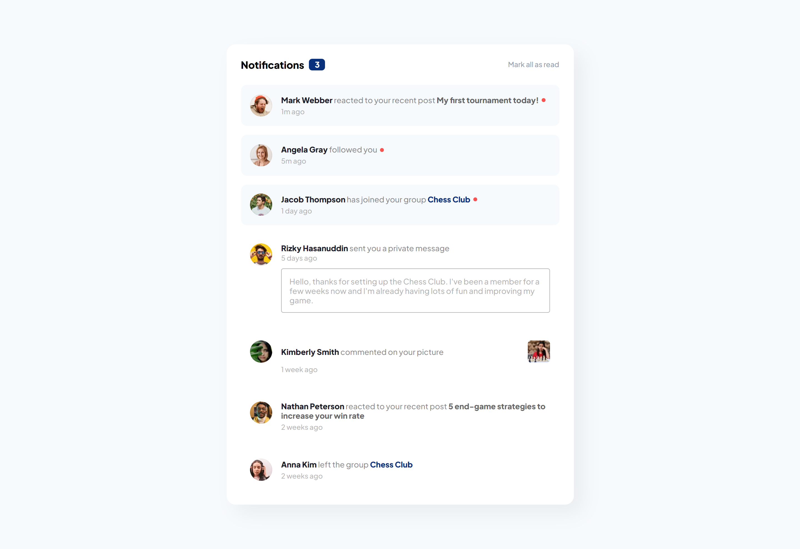
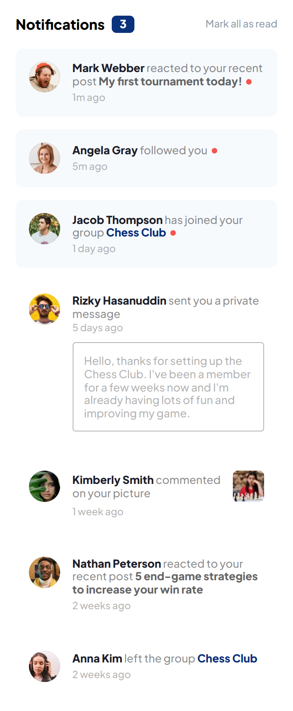

# Frontend Mentor - Notifications page solution

This is a solution to the [Notifications page challenge on Frontend Mentor](https://www.frontendmentor.io/challenges/notifications-page-DqK5QAmKbC). 

## Table of contents

- [Overview](#overview)
  - [The challenge](#the-challenge)
  - [Screenshot](#screenshot)
  - [Links](#links)
- [My process](#my-process)
  - [Built with](#built-with)
- [Author](#author)

## Overview

### The challenge

Users should be able to:

- Distinguish between "unread" and "read" notifications
- Select "Mark all as read" to toggle the visual state of the unread notifications and set the number of unread messages to zero
- View the optimal layout for the interface depending on their device's screen size
- See hover and focus states for all interactive elements on the page

### Screenshot

| Desktop View                     | Mobile View                    |
| -------------------------------- | ------------------------------ |
|  |  |

### Links

- Solution URL: [Simple Notifications Page](https://www.frontendmentor.io/solutions/simple-notifications-page-u6X-1Us4uf)
- Live Site URL: [tobiii-np.vercel.app](https://tobiii-np.vercel.app/)

## My process

### Built with

- Semantic HTML5 markup
- CSS custom properties
- Flexbox
- Mobile-first workflow
- JavaScript

## Author

- Website - [Emmanuel Adeyeye](https://tobiii.vercel.app/)
- Frontend Mentor - [@purrrplelipton](https://www.frontendmentor.io/profile/purrrplelipton)
- Twitter - [@purrrplelipton](https://www.twitter.com/purrrplelipton)
